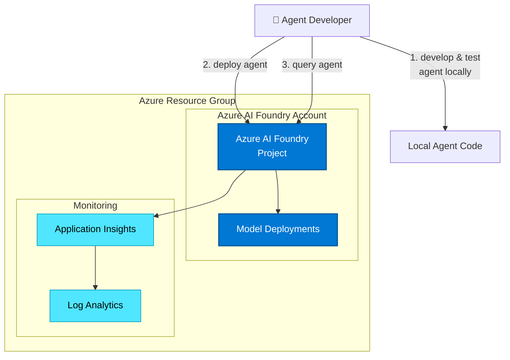

# GenAI Operations - Trail Guide Agent Workshop

This repository contains a comprehensive workshop and reference implementation for building, evaluating, and deploying GenAI applications using Microsoft Azure AI Foundry. The project demonstrates end-to-end GenAIOps practices including prompt management, manual and automated evaluation, safety testing, deployment, and monitoring.

**Adventure Works Outdoor Gear - AI Trail Assistant**: The central use case demonstrates how to build an intelligent trail guide agent that helps outdoor enthusiasts find and explore hiking trails.

[Repository Structure](#repository-structure) • [Getting Started](#getting-started) • [Agents & Applications](#agents--applications) • [Documentation](#documentation)

## Repository Structure

```
mslearn-genaiops/
├── infra/                          # Infrastructure as Code (Bicep)
│   ├── main.bicep                  # Main infrastructure definition
│   ├── main.parameters.json        # Infrastructure parameters
│   └── core/                       # Modular infrastructure components
│       ├── ai/                     # AI Foundry project & connections
│       └── monitor/                # Application Insights & Log Analytics
│
├── src/
│   ├── agents/                     # AI Agent implementations
│   │   ├── trail_guide_agent/      # Main trail recommendation agent
│   │   ├── model_comparison/       # Model evaluation & comparison
│   │   ├── prompt_optimization/    # Prompt engineering workflows
│   │   └── monitoring_agent/       # Observability demonstrations
│   │
│   ├── evaluators/                 # Custom evaluation logic
│   │   ├── quality_evaluators.py   # Quality metrics (relevance, coherence)
│   │   └── safety_evaluators.py    # Safety & red-teaming evaluators
│   │
│   └── tests/                      # Test suites
│       └── test_trail_guide_agents.py
│
├── data/
│   └── datasets/                   # Workshop data assets
│       ├── app_hotel_reviews.csv   # Sample review dataset
│       └── evaluation_rubrics.md   # Evaluation criteria
│
├── docs/                           # Workshop documentation
│   ├── 01-infrastructure-setup.md
│   ├── 02-prompt-management.md
│   ├── 03-manual-evaluation.md
│   ├── 04-automated-evaluation.md
│   ├── 05-safety-red-teaming.md
│   ├── 06-deployment-monitoring.md
│   ├── scenario.md                 # Use case overview
│   ├── spec.md                     # Technical specifications
│   └── modules/                    # Learning modules
│
├── requirements.txt                # Python dependencies
├── azure.yaml                      # Azure Developer CLI config
└── README.md                       # This file
```

## Features

### GenAIOps Practices Demonstrated

* **Prompt Versioning & Management**: Version-controlled prompts with structured iteration (v1, v2, v3)
* **Manual Evaluation**: Human-in-the-loop evaluation workflows for quality assessment
* **Automated Evaluation**: Programmatic quality and safety evaluators with metrics
* **Model Comparison**: Side-by-side comparison of different AI models
* **Prompt Optimization**: Token optimization and efficiency improvements
*  Agents & Applications

### Trail Guide Agent
**Location**: `src/agents/trail_guide_agent/`

The main application - an AI agent that provides personalized hiking trail recommendations for Adventure Works Outdoor Gear customers.

**Key Components**:
- `trail_guide_agent.py`: Main agent implementation using Azure AI Projects SDK
- `prompts/v1_instructions.txt`: Initial prompt version
- `prompts/v2_instructions.txt`: Improved prompt iteration
- `prompts/v3_instructions.txt`: Optimized final version

**Capabilities**:
- Natural language trail queries
- Personalized recommendations based on user preferences
- Safety information and trail conditions
- Multi-turn conversational interactions

### Model Comparison Agent
**Location**: `src/agents/model_comparison/`

Demonstrates comparing different AI models (GPT-4, GPT-4o-mini, etc.) for performance, quality, and cost trade-offs.

**Key Files**:
- `02-Compare-models.ipynb`: Jupyter notebook for model comparison
- `06-Optimize-your-model.ipynb`: Model optimization techniques
- `model1.py`, `model2.py`: Different model configurations
- `generate_synth_data.py`: Synthetic test data generation
- `plot.py`: Visualization utilities

### Prompt Optimization Agent
**Location**: `src/agents/prompt_optimization/`

Shows techniques for optimizing prompts for quality, efficiency, and token usage.

**Key Files**:
- `optimize-prompt.py`: Automated prompt optimization
- `start.prompty`: Initial prompt template
- `solution-0.prompty`, `solution-1.prompty`: Optimized versions
- `token-count.py`: Token usage analysis

### Monitoring Agent
**Location**: `src/agents/monitoring_agent/`

Demonstrates observability patterns for production AI agents.

**Key Files**:
- `start-prompt.py`: Initial monitoring setup
- `error-prompt.py`: Error handling demonstrations
- `Documentation

The `docs/` directory contains comprehensive workshop materials:

| Document | Description |
|----------|-------------|
| [scenario.md](docs/scenario.md) | Adventure Works use case and business context |
| [spec.md](docs/spec.md) | Technical specifications and requirements |
| [constitution.md](docs/constitution.md) | AI safety guidelines and principles |
| [plan.md](docs/plan.md) | Workshop delivery plan |
| [01-infrastructure-setup.md](docs/01-infrastructure-setup.md) | Azure infrastructure provisioning |
| [02-prompt-management.md](docs/02-prompt-management.md) | Prompt versioning and iteration |
| [03-manual-evaluation.md](docs/03-manual-evaluation.md) | Human evaluation workflows |
| [04-automated-evaluation.md](docs/04-automated-evaluation.md) | Automated testing and metrics |
| [05-safety-red-teaming.md](docs/05-safety-red-teaming.md) | Adversarial testing |
| [06-deployment-monitoring.md](docs/06-deployment-monitoring.md) | Production deployment |

### Learning Modules

- `docs/modules/prompt-versioning-microsoft-foundry.md`
- `docs/modules/manual-evaluation-genai-applications.md`
- `docs/modules/automated-evaluation-genai-workflows.md`

## Getting Started

### Prerequisites

1. **Azure Subscription**: Active Azure subscription with appropriate permissions
2. **Azure Developer CLI (azd)**: 
   - Windows: `winget install microsoft.azd`
   - Linux: `curl -fsSL https://aka.ms/install-azd.sh | bash`
   - macOS: `brew tap azure/azd && brew install azd`
3. **Python 3.11+**: Required for running agents
4. **VS Code** (recommended): For optimal development experience

### Installation

1. **Clone the repository**:
   ```bash
   Workshop Learning Path

Follow the documentation in sequence for a complete GenAIOps learning experience:

1. **Setup**: Provision infrastructure and configure environment
2. **Build**: Create your first agent with prompt management
3. **Evaluate**: Test manually and with automated evaluators
4. **Optimize**: Compare models and optimize prompts
5. **Secure**: Run safety evaluations and red-teaming
6. **Deploy**: Push to production with monitoring

## Data Assets

### Datasets
**Location**: `data/datasets/`

- `app_hotel_reviews.csv`: Sample customer review data for evaluation testing
- `evaluation_rubrics.md`: Grading criteria and quality standards for evaluators

## Testing

Run the test suite:
```bash
pytest src/tests/
```

Run specific test file:
```bash
pytest src/tests/test_trail_guide_agents.py -v
```

## Development Workflow

1. **Modify prompts**: Edit files in `src/agents/trail_guide_agent/prompts/`
2. **Run agent locally**: Test changes with `python src/agents/trail_guide_agent/trail_guide_agent.py`
3. **Evaluate**: Run evaluators in `src/evaluators/`
4. **Compare models**: Use notebooks in `src/agents/model_comparison/`
5. **Deploy**: Use `azd` commands to deploy to Azure

## Guidance

### Region Availability

ChecKey Dependencies

This project uses the following key packages:

| Package | Version | Purpose |
|---------|---------|---------|
| `azure-ai-projects` | `>=1.0.0b1` | Azure AI Foundry SDK (preview) |
| `azure-identity` | `>=1.15.0` | Azure authentication |
| `pandas` | `>=2.1.0` | Data processing for evaluations |
| `pytest` | `>=7.4.0` | Testing framework |
| `python-dotenv` | `>=1.0.0` | Environment configuration |

> **Note**: The preview version (`b1` or later) of `azure-ai-projects` is required for agent functionality.

### Security Guidelines
Contributing

Contributions are welcome! Please follow these guidelines:

1. Fork the repository
2. Create a feature branch (`git checkout -b feature/amazing-feature`)
3. Commit your changes (`git commit -m 'Add amazing feature'`)
4. Push to the branch (`git push origin feature/amazing-feature`)
5. Open a Pull Request

## Support

For issues and questions:
- **GitHub Issues**: Report bugs or request features
- **Documentation**: Check the `docs/` directory
- **Microsoft Learn**: [Azure AI Foundry documentation](https://learn.microsoft.com/azure/ai-foundry/)

## License

This project is licensed under the MIT License - see [LICENSE](LICENSE) for details.

## 
This project implements Azure security best practices:

- **Managed Identity**: Keyless authentication between services
- **No hardcoded secrets**: All credentials via Azure Key Vault or environment variables
- **GitHub secret scanning**: Enabled for credential detection
- **Principle of least privilege**: Minimal required permissions

Additional security measures to consider for production:

- Enable [Microsoft Defender for Cloud](https://learn.microsoft.com/azure/defender-for-cloud/)
- Implement [Virtual Network isolation](https://learn.microsoft.com/azure/container-apps/networking)
- Configure [Azure Firewall](https://learn.microsoft.com/azure/container-apps/waf-app-gateway)
- Enable [Microsoft Purview](https://learn.microsoft.com/azure/purview/) for data governance

3. **Install dependencies**:
   ```bash
   pip install -r requirements.txt
   ```
   
   > ⚠️ **Important**: This project requires the **preview version** of `azure-ai-projects` (version 2.0.0b3 or later) to access the `PromptAgentDefinition` class and other agent features.

4. **Set up environment variables**:
   Create a `.env` file in the root directory:
   ```bash
   AZURE_AI_PROJECT_ENDPOINT=https://your-project.api.azureml.ms
   AGENT_NAME=trail-guide
   MODEL_NAME=gpt-4o-mini
   ```

5. **Provision Azure infrastructure**:
   ```bash
   azd auth login
   azd up
   ```

### Quick Start - Run the Trail Guide Agent

```bash
python src/agents/trail_guide_agent/trail_guide_agent.py
```

Expected output:
```
Agent created (id: trail-guide:1, name: trail-guide, version: 1)
```
| Resource | Description |
|----------|-------------|
| [Microsoft Foundry](https://learn.microsoft.com/azure/ai-foundry) | Provides a collaborative workspace for AI development with access to models, data, and compute resources |
| [Application Insights](https://learn.microsoft.com/azure/azure-monitor/app/app-insights-overview) | Provides application performance monitoring, logging, and telemetry for debugging and optimization |
| [Log Analytics Workspace](https://learn.microsoft.com/azure/azure-monitor/logs/log-analytics-workspace-overview) | Collects and analyzes telemetry data for monitoring and troubleshooting |

### Architecture Diagram



The template is parametrized and can be configured with additional resources:

* Deploy AI models by setting `AI_PROJECT_DEPLOYMENTS` with a list of model deployment configs
* Enable monitoring with `ENABLE_MONITORING=true` (enabled by default)

## Getting Started

Note: this repository is not meant to be cloned, but to be consumed as a template in your own project:

```bash
azd init --template Azure-Samples/ai-foundry-starter-basic
```

### Prerequisites

* Install [azd](https://aka.ms/install-azd)
  * Windows: `winget install microsoft.azd`
  * Linux: `curl -fsSL https://aka.ms/install-azd.sh | bash`
  * MacOS: `brew tap azure/azd && brew install azd`

### Quickstart

1. Bring down the template code:

    ```shell
    azd init --template Azure-Samples/ai-foundry-starter-basic
    ```

    This will perform a git clone

2. Sign into your Azure account:

    ```shell
    azd auth login
    ```

3. Download a sample agent from GitHub:

    ```shell
    azd ai agent init -m <repo-path-to-agent.yaml>
    ```

You'll find agent samples in the [`foundry-samples` repo](https://github.com/azure-ai-foundry/foundry-samples/tree/main/samples/microsoft/python/getting-started-agents/hosted-agents).

## Guidance

### Region Availability

This template does not use specific models. The model deployments are a parameter of the template. Each model may not be available in all Azure regions. Check for [up-to-date region availability of Microsoft Foundry](https://learn.microsoft.com/en-us/azure/ai-foundry/reference/region-support) and in particular the [Agent Service](https://learn.microsoft.com/en-us/azure/ai-foundry/agents/concepts/model-region-support?tabs=global-standard).

## Resource Clean-up

To prevent incurring unnecessary charges, it's important to clean up your Azure resources after completing your work with the application.

- **When to Clean Up:**
  - After you have finished testing or demonstrating the application.
  - If the application is no longer needed or you have transitioned to a different project or environment.
  - When you have completed development and are ready to decommission the application.

- **Deleting Resources:**
  To delete all associated resources and shut down the application, execute the following command:
  
    ```bash
    azd down
    ```

    Please note that this process may take up to 20 minutes to complete.

⚠️ Alternatively, you can delete the resource group directly from the Azure Portal to clean up resources.

### Costs

Pricing varies per region and usage, so it isn't possible to predict exact costs for your usage.
The majority of the Azure resources used in this infrastructure are on usage-based pricing tiers.

You can try the [Azure pricing calculator](https://azure.microsoft.com/pricing/calculator) for the resources deployed in this template.

* **Microsoft Foundry**: Standard tier. [Pricing](https://azure.microsoft.com/pricing/details/ai-foundry/)
* **Azure AI Services**: S0 tier, defaults to gpt-4o-mini. Pricing is based on token count. [Pricing](https://azure.microsoft.com/pricing/details/cognitive-services/)
* **Log Analytics**: Pay-as-you-go tier. Costs based on data ingested. [Pricing](https://azure.microsoft.com/pricing/details/monitor/)
* **Application Insights**: Part of Azure Monitor. Pricing based on data ingestion. [Pricing](https://azure.microsoft.com/pricing/details/monitor/)

⚠️ To avoid unnecessary costs, remember to take down your app if it's no longer in use, either by deleting the resource group in the Portal or running `azd down`.

### Security Guidelines

This project implements Azure security best practices:

- **Managed Identity**: Keyless authentication between services for local development and deployment
- **No hardcoded secrets**: All credentials via Azure Key Vault or environment variables
- **GitHub secret scanning**: Enabled for credential detection
- **Principle of least privilege**: Minimal required permissions

Additional security measures to consider for production:

- Enable [Microsoft Defender for Cloud](https://learn.microsoft.com/azure/defender-for-cloud/) to secure your Azure resources
- Implement network security controls and private endpoints where applicable
- Enable [Microsoft Purview](https://learn.microsoft.com/azure/purview/) for data governance
- Review and apply [AI security best practices](https://learn.microsoft.com/azure/ai-foundry/concepts/security)

> **Important Security Notice**  
> This template has been built to showcase Microsoft Azure specific services and tools. We strongly advise customers not to make this code part of their production environments without implementing additional security features. For a comprehensive list of best practices, [visit our official documentation](https://learn.microsoft.com/azure/ai-foundry/).

## Additional Disclaimers

**Trademarks** This project may contain trademarks or logos for projects, products, or services. Authorized use of Microsoft trademarks or logos is subject to and must follow [Microsoft’s Trademark & Brand Guidelines](https://www.microsoft.com/en-us/legal/intellectualproperty/trademarks/usage/general). Use of Microsoft trademarks or logos in modified versions of this project must not cause confusion or imply Microsoft sponsorship. Any use of third-party trademarks or logos are subject to those third-party’s policies.

To the extent that the Software includes components or code used in or derived from Microsoft products or services, including without limitation Microsoft Azure Services (collectively, “Microsoft Products and Services”), you must also comply with the Product Terms applicable to such Microsoft Products and Services. You acknowledge and agree that the license governing the Software does not grant you a license or other right to use Microsoft Products and Services. Nothing in the license or this ReadMe file will serve to supersede, amend, terminate or modify any terms in the Product Terms for any Microsoft Products and Services.

You must also comply with all domestic and international export laws and regulations that apply to the Software, which include restrictions on destinations, end users, and end use. For further information on export restrictions, visit <https://aka.ms/exporting>.

You acknowledge that the Software and Microsoft Products and Services (1) are not designed, intended or made available as a medical device(s), and (2) are not designed or intended to be a substitute for professional medical advice, diagnosis, treatment, or judgment and should not be used to replace or as a substitute for professional medical advice, diagnosis, treatment, or judgment. Customer is solely responsible for displaying and/or obtaining appropriate consents, warnings, disclaimers, and acknowledgements to end users of Customer’s implementation of the Online Services.

You acknowledge the Software is not subject to SOC 1 and SOC 2 compliance audits. No Microsoft technology, nor any of its component technologies, including the Software, is intended or made available as a substitute for the professional advice, opinion, or judgement of a certified financial services professional. Do not use the Software to replace, substitute, or provide professional financial advice or judgment.  

BY ACCESSING OR USING THE SOFTWARE, YOU ACKNOWLEDGE THAT THE SOFTWARE IS NOT DESIGNED OR INTENDED TO SUPPORT ANY USE IN WHICH A SERVICE INTERRUPTION, DEFECT, ERROR, OR OTHER FAILURE OF THE SOFTWARE COULD RESULT IN THE DEATH OR SERIOUS BODILY INJURY OF ANY PERSON OR IN PHYSICAL OR ENVIRONMENTAL DAMAGE (COLLECTIVELY, “HIGH-RISK USE”), AND THAT YOU WILL ENSURE THAT, IN THE EVENT OF ANY INTERRUPTION, DEFECT, ERROR, OR OTHER FAILURE OF THE SOFTWARE, THE SAFETY OF PEOPLE, PROPERTY, AND THE ENVIRONMENT ARE NOT REDUCED BELOW A LEVEL THAT IS REASONABLY, APPROPRIATE, AND LEGAL, WHETHER IN GENERAL OR IN A SPECIFIC INDUSTRY. BY ACCESSING THE SOFTWARE, YOU FURTHER ACKNOWLEDGE THAT YOUR HIGH-RISK USE OF THE SOFTWARE IS AT YOUR OWN RISK.
