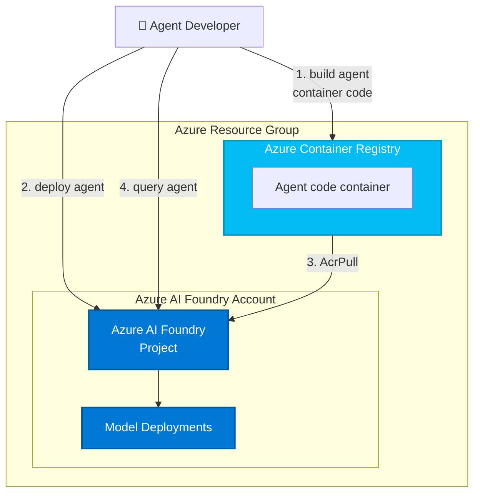

# GenAIOps Learning Path with Microsoft Foundry

This repository provides hands-on labs for implementing GenAIOps practices using Microsoft Foundry. Learn to build, evaluate, deploy, and monitor production-ready generative AI applications through practical exercises covering the complete AI development lifecycle.

## 📚 Learning Paths

This repository contains two complementary learning paths that can be completed independently or together:

---

## Learning Path 1: Operationalize Generative AI Applications (GenAIOps)

Build, evaluate, and deploy production-ready generative AI applications with systematic workflows.

1. **[Plan and prepare a GenAIOps solution](docs/01-infrastructure-setup.md)** - Establish foundational infrastructure and development workflows for AI applications
2. **[Manage agent artifacts with GitHub](docs/02-prompt-management.md)** - Organize and version control agents, prompts, models, and other AI artifacts using GitHub
3. **[Design and optimize prompts](docs/03-design-optimize-prompts.md)** - Learn systematic prompt engineering, iteration techniques, and optimization strategies
4. **Optimize RAG solutions for GenAI** *(Coming soon)* - Implement retrieval-augmented generation patterns for context-aware AI
5. **Create custom fine-tuning workflows for GenAI** *(Coming soon)* - Build automated pipelines for model customization
6. **Deploy GenAI apps and agents with CI/CD integration** *(Coming soon)* - Automate deployment pipelines for continuous delivery

---

## Learning Path 2: Implement Observability for GenAI Applications and Agents

Monitor, trace, debug, and optimize AI applications in production with comprehensive observability practices.

1. **Plan and prepare an observability strategy** *(Coming soon)* - Design comprehensive monitoring approaches for AI systems
2. **Evaluate model risks with simulated inputs** *(Coming soon)* - Test production models against edge cases and adversarial scenarios
3. **Build evaluation pipelines** *(Coming soon)* - Automate quality gates and performance benchmarks in deployment workflows
4. **Build and run red-team pipelines for generative AI security** *(Coming soon)* - Implement automated security testing and adversarial evaluation
5. **[Monitor your generative AI application](docs/06-deployment-monitoring.md)** - Deploy agents and configure Application Insights, Log Analytics, and telemetry collection
6. **Analyze and debug your generative AI app with tracing** *(Coming soon)* - Use distributed tracing to diagnose AI application issues and understand agent behavior
7. **Optimize performance and costs** *(Coming soon)* - Reduce latency and token consumption while maintaining quality
8. **Implement security and governance for GenAI apps** *(Coming soon)* - Apply enterprise security controls and compliance requirements

---

## 📚 Foundational Labs

These labs provide essential skills for both learning paths and can be completed independently:

- **[Plan and prepare a GenAIOps solution](docs/01-infrastructure-setup.md)** - Deploy Microsoft Foundry resources and configure your development environment (prerequisite for both paths)
- **[Manual evaluation](docs/03-manual-evaluation.md)** - Conduct human-in-the-loop assessments of agent responses
- **[Automated evaluation](docs/04-automated-evaluation.md)** - Build evaluation pipelines with simulated inputs and AI-assisted grading
- **[Safety and red-teaming](docs/05-safety-red-teaming.md)** - Test AI systems for security risks and adversarial scenarios

---

## 🎯 What You'll Build

Throughout these learning paths, you'll work with a realistic scenario: **Adventure Works Trail Guide Agent** - an AI-powered assistant that helps hikers plan trail adventures, get gear recommendations, and receive real-time support.

### Learning Path 1 Outcomes
- ✅ Plan and prepare GenAIOps solutions for production AI applications
- ✅ Organize and version control agent artifacts with GitHub
- ✅ Design and optimize prompts using systematic engineering techniques
- ✅ Implement retrieval-augmented generation (RAG) patterns
- ✅ Create custom fine-tuning workflows for model optimization
- ✅ Automate deployments with CI/CD pipelines

### Learning Path 2 Outcomes
- ✅ Design comprehensive observability strategies for AI systems
- ✅ Configure monitoring infrastructure with Application Insights
- ✅ Trace and debug agent conversations and API calls
- ✅ Evaluate model behavior with simulated production scenarios
- ✅ Optimize costs and performance while maintaining quality
- ✅ Implement security controls and governance policies

[Features](#features) • [Getting Started](#getting-started) • [Guidance](#guidance)

## 🧪 Sample Agents and Tools

This repository includes several sample agents and tools to support the learning labs:

### Agents

- **Trail guide agent** (`src/agents/trail_guide_agent/`) - Multi-version agent demonstrating prompt evolution and version management
  - V1: Basic trail recommendations
  - V2: Enhanced with accommodation and gear suggestions
  - V3: Advanced with safety monitoring and personalization

- **Monitoring agent** (`src/agents/monitoring_agent/`) - Examples for error handling, prompt optimization, and observability patterns

### Tools and utilities

- **Model comparison** (`src/agents/model_comparison/`) - Compare performance across different model configurations
  - Interactive notebooks for benchmarking
  - Visualization tools for model analysis

- **Prompt optimization** (`src/agents/prompt_optimization/`) - Tools for iterating and improving prompts
  - Token counting utilities
  - A/B testing frameworks

- **Evaluators** (`src/evaluators/`) - Quality and safety evaluation modules
  - Quality evaluators for response accuracy
  - Safety evaluators for adversarial testing

- **Tests** (`src/tests/`) - Automated test suites for agent behavior validation

## 📋 Prerequisites

Before starting the labs, ensure you have:

- **Azure Subscription** with Microsoft Foundry access
- **Visual Studio Code** with Python extension
- **Python 3.9 or later**
- **Azure CLI** (`az`) - [Install](https://learn.microsoft.com/cli/azure/install-azure-cli)
- **Azure Developer CLI** (`azd`) - [Install](https://aka.ms/install-azd)
- **Git** and **GitHub account**

---

## 🚀 Suggested Additional Labs

Based on the existing code in this repository and the new Microsoft Foundry experience, here are recommended labs to add:

### Learning Path 1: GenAIOps extensions
- **RAG with grounding**: Use the existing Bing Search and Azure AI Search infrastructure to build retrieval-augmented generation patterns
- **Model comparison lab**: Leverage `src/agents/model_comparison/` notebooks to systematically compare GPT-4, GPT-4o, and other models
- **Prompt engineering deep-dive**: Use `src/agents/prompt_optimization/` to teach systematic prompt iteration and token optimization
- **Custom evaluators**: Build domain-specific evaluators extending `src/evaluators/quality_evaluators.py`
- **Synthetic data generation**: Use the existing `generate_synth_data.py` for creating evaluation datasets
- **Multi-agent testing**: Test interactions between trail guide agent and other specialized agents

### Learning Path 2: Observability extensions
- **Foundry tracing UI**: Use built-in observability features for debugging agent conversations
- **Cost analysis dashboard**: Build custom monitoring views to track and optimize spending
- **A/B testing in production**: Deploy multiple agent versions and compare live performance metrics
- **Incident response playbook**: Use `src/agents/monitoring_agent/` error handling patterns to build runbooks
- **Performance profiling**: Identify and optimize slow LLM calls and data operations
- **Anomaly detection**: Set up automated alerts for unusual usage patterns or quality degradation

### Cross-path labs
- **Project management and collaboration**: Multi-user workflows, sharing agents, and permission management
- **Agent tools and functions**: Extend agents with custom tools and API integrations
- **Deployment slots**: Blue-green deployments and safe rollout strategies

This template, the application code and configuration it contains, has been built to showcase Microsoft Azure specific services and tools. We strongly advise our customers not to make this code part of their production environments without implementing or enabling additional security features.

With any AI solutions you create using these templates, you are responsible for assessing all associated risks, and for complying with all applicable laws and safety standards. Learn more in the transparency documents for [Agent Service](https://learn.microsoft.com/en-us/azure/ai-foundry/responsible-ai/agents/transparency-note) and [Agent Framework](https://github.com/microsoft/agent-framework/blob/main/TRANSPARENCY_FAQ.md).

## Features

This learning repository provides:

### Infrastructure as code
* **Microsoft Foundry project**: Complete setup with project configuration and model deployments
* **Azure Container Registry**: Container image storage for agent deployments
* **Monitoring stack**: Application Insights and Log Analytics for observability
* **Managed identity**: Keyless authentication between services

### GenAIOps capabilities
* **Prompt versioning**: Manage prompts as code with version control integration
* **Multi-model testing**: Compare performance across model configurations
* **Automated evaluation**: AI-assisted grading and quality assessment pipelines
* **Safety testing**: Red-teaming and adversarial scenario testing
* **Production monitoring**: Tracing, logging, and performance optimization
* **CI/CD integration**: Automated deployment and testing workflows

### Architecture Diagram

This starter kit will provision the bare minimum for your hosted agent to work (if `ENABLE_HOSTED_AGENTS=true`).

| Resource | Description |
|----------|-------------|
| [Microsoft Foundry](https://learn.microsoft.com/azure/ai-foundry) | Provides a collaborative workspace for AI development with access to models, data, and compute resources |
| [Azure Container Registry](https://learn.microsoft.com/azure/container-registry/) | Stores and manages container images for secure deployment |
| [Application Insights](https://learn.microsoft.com/azure/azure-monitor/app/app-insights-overview) | *Optional* - Provides application performance monitoring, logging, and telemetry for debugging and optimization |
| [Log Analytics Workspace](https://learn.microsoft.com/azure/azure-monitor/logs/log-analytics-workspace-overview) | *Optional* - Collects and analyzes telemetry data for monitoring and troubleshooting |

Those resources will be used by the [`azd ai agent` extension](https://aka.ms/azdaiagent/docs) when building and deploying agents:



The template is parametrized so that it can be configured with additional resources depending on the agent requirements:

* deploy AI models by setting `AI_PROJECT_DEPLOYMENTS` with a list of model deployment configs,
* provision additional resources (Azure AI Search, Bing Search) by setting `AI_PROJECT_DEPENDENT_RESOURCES`,
* enable monitoring by setting `ENABLE_MONITORING=true` (default on),
* provision connections by setting `AI_PROJECT_CONNECTIONS` with a list of connection configs.

## Getting Started

### For Learning Path Participants

**Learning Path 1: Operationalize generative AI applications (GenAIOps)**
- Complete [Plan and prepare a GenAIOps solution](docs/01-infrastructure-setup.md) as prerequisite
- Start with Module 2: [Manage agent artifacts with GitHub](docs/02-prompt-management.md)
- Follow all 6 modules in sequence
- Each lab builds on previous work with the Trail Guide Agent

**Learning Path 2: Implement observability for GenAI applications**
- Can be started independently or after Learning Path 1
- Begin with planning your observability strategy
- Module 5: [Monitor your generative AI application](docs/06-deployment-monitoring.md) covers deployment and monitoring setup
- Requires an existing AI application (use Trail Guide Agent from Learning Path 1, or bring your own)

Both paths include:
- Clear learning objectives
- Step-by-step instructions
- Verification checkpoints
- Hands-on exercises

### For Template Users

This repository also serves as an `azd` template for bootstrapping new Microsoft Foundry projects:

```bash
azd init --template Azure-Samples/ai-foundry-starter-basic
```

This will provision the infrastructure without the learning materials.

### Prerequisites

## Guidance

### Region Availability

This template does not use specific models. The model deployments are a parameter of the template. Each model may not be available in all Azure regions. Check for [up-to-date region availability of Microsoft Foundry](https://learn.microsoft.com/en-us/azure/ai-foundry/reference/region-support) and in particular the [Agent Service](https://learn.microsoft.com/en-us/azure/ai-foundry/agents/concepts/model-region-support?tabs=global-standard).

## Resource Clean-up

To prevent incurring unnecessary charges, it's important to clean up your Azure resources after completing your work with the application.

- **When to Clean Up:**
  - After you have finished testing or demonstrating the application.
  - If the application is no longer needed or you have transitioned to a different project or environment.
  - When you have completed development and are ready to decommission the application.

- **Deleting Resources:**
  To delete all associated resources and shut down the application, execute the following command:
  
    ```bash
    azd down
    ```

    Please note that this process may take up to 20 minutes to complete.

⚠️ Alternatively, you can delete the resource group directly from the Azure Portal to clean up resources.

### Costs

Pricing varies per region and usage, so it isn't possible to predict exact costs for your usage.
The majority of the Azure resources used in this infrastructure are on usage-based pricing tiers.

You can try the [Azure pricing calculator](https://azure.microsoft.com/pricing/calculator) for the resources deployed in this template.

* **Microsoft Foundry**: Standard tier. [Pricing](https://azure.microsoft.com/pricing/details/ai-foundry/)
* **Azure AI Services**: S0 tier, defaults to gpt-4o-mini. Pricing is based on token count. [Pricing](https://azure.microsoft.com/pricing/details/cognitive-services/)
* **Azure Container Registry**: Basic SKU. Price is per day and on storage. [Pricing](https://azure.microsoft.com/en-us/pricing/details/container-registry/)
* **Azure Storage Account**: Standard tier, LRS. Pricing is based on storage and operations. [Pricing](https://azure.microsoft.com/pricing/details/storage/blobs/)
* **Log analytics**: Pay-as-you-go tier. Costs based on data ingested. [Pricing](https://azure.microsoft.com/pricing/details/monitor/)
* **Azure AI Search**: Basic tier, LRS. Price is per day and based on transactions. [Pricing](https://azure.microsoft.com/en-us/pricing/details/search/)
* **Grounding with Bing Search**: G1 tier. Costs based on transactions. [Pricing](https://www.microsoft.com/en-us/bing/apis/grounding-pricing)

⚠️ To avoid unnecessary costs, remember to take down your app if it's no longer in use, either by deleting the resource group in the Portal or running `azd down`.

### Security guidelines

This template also uses [Managed Identity](https://learn.microsoft.com/entra/identity/managed-identities-azure-resources/overview) for local development and deployment.

To ensure continued best practices in your own repository, we recommend that anyone creating solutions based on our templates ensure that the [Github secret scanning](https://docs.github.com/code-security/secret-scanning/about-secret-scanning) setting is enabled.

You may want to consider additional security measures, such as:

- Enabling Microsoft Defender for Cloud to [secure your Azure resources](https://learn.microsoft.com/azure/defender-for-cloud/).
- Protecting the Azure Container Apps instance with a [firewall](https://learn.microsoft.com/azure/container-apps/waf-app-gateway) and/or [Virtual Network](https://learn.microsoft.com/azure/container-apps/networking?tabs=workload-profiles-env%2Cazure-cli).

> **Important Security Notice** <br/>
This template, the application code and configuration it contains, has been built to showcase Microsoft Azure specific services and tools. We strongly advise our customers not to make this code part of their production environments without implementing or enabling additional security features.  <br/><br/>
For a more comprehensive list of best practices and security recommendations for Intelligent Applications, [visit our official documentation](https://learn.microsoft.com/en-us/azure/ai-foundry/).

## Additional Disclaimers

**Trademarks** This project may contain trademarks or logos for projects, products, or services. Authorized use of Microsoft trademarks or logos is subject to and must follow [Microsoft’s Trademark & Brand Guidelines](https://www.microsoft.com/en-us/legal/intellectualproperty/trademarks/usage/general). Use of Microsoft trademarks or logos in modified versions of this project must not cause confusion or imply Microsoft sponsorship. Any use of third-party trademarks or logos are subject to those third-party’s policies.

To the extent that the Software includes components or code used in or derived from Microsoft products or services, including without limitation Microsoft Azure Services (collectively, “Microsoft Products and Services”), you must also comply with the Product Terms applicable to such Microsoft Products and Services. You acknowledge and agree that the license governing the Software does not grant you a license or other right to use Microsoft Products and Services. Nothing in the license or this ReadMe file will serve to supersede, amend, terminate or modify any terms in the Product Terms for any Microsoft Products and Services.

You must also comply with all domestic and international export laws and regulations that apply to the Software, which include restrictions on destinations, end users, and end use. For further information on export restrictions, visit <https://aka.ms/exporting>.

You acknowledge that the Software and Microsoft Products and Services (1) are not designed, intended or made available as a medical device(s), and (2) are not designed or intended to be a substitute for professional medical advice, diagnosis, treatment, or judgment and should not be used to replace or as a substitute for professional medical advice, diagnosis, treatment, or judgment. Customer is solely responsible for displaying and/or obtaining appropriate consents, warnings, disclaimers, and acknowledgements to end users of Customer’s implementation of the Online Services.

You acknowledge the Software is not subject to SOC 1 and SOC 2 compliance audits. No Microsoft technology, nor any of its component technologies, including the Software, is intended or made available as a substitute for the professional advice, opinion, or judgement of a certified financial services professional. Do not use the Software to replace, substitute, or provide professional financial advice or judgment.  

BY ACCESSING OR USING THE SOFTWARE, YOU ACKNOWLEDGE THAT THE SOFTWARE IS NOT DESIGNED OR INTENDED TO SUPPORT ANY USE IN WHICH A SERVICE INTERRUPTION, DEFECT, ERROR, OR OTHER FAILURE OF THE SOFTWARE COULD RESULT IN THE DEATH OR SERIOUS BODILY INJURY OF ANY PERSON OR IN PHYSICAL OR ENVIRONMENTAL DAMAGE (COLLECTIVELY, “HIGH-RISK USE”), AND THAT YOU WILL ENSURE THAT, IN THE EVENT OF ANY INTERRUPTION, DEFECT, ERROR, OR OTHER FAILURE OF THE SOFTWARE, THE SAFETY OF PEOPLE, PROPERTY, AND THE ENVIRONMENT ARE NOT REDUCED BELOW A LEVEL THAT IS REASONABLY, APPROPRIATE, AND LEGAL, WHETHER IN GENERAL OR IN A SPECIFIC INDUSTRY. BY ACCESSING THE SOFTWARE, YOU FURTHER ACKNOWLEDGE THAT YOUR HIGH-RISK USE OF THE SOFTWARE IS AT YOUR OWN RISK.
